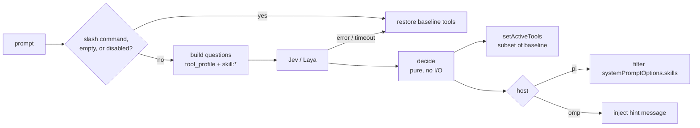

# pi-classifier-tools-skills

An extension for **Oh My Pi (omp)** and **pi** that uses a System-One classifier
(**Jev** from TypeSafe, or **Laya**) to choose the **tools** and **skills** the
model gets on each turn.

Before each turn, the prompt is classified once:

- one `choice` question picks a **tool profile** (for example `answer`, `edit`,
  `full`), and the turn runs with only that profile's tools active;
- one `noul` (yes/no) question per **skill** scores its relevance, and only the
  top-scoring skills are shown to the model.

The design follows
[pi-classifier-router](https://gitlab.com/ejstembler/pi-classifier-router),
which routes prompts to models. Its Jev/Laya clients and Laya worker are reused
here unchanged (MIT).



## Guarantees

- **It never breaks a turn.** A classifier failure, a timeout, or a bug restores
  the full loadout and shows a warning.
- **It never adds a tool.** A selection is always a subset of the **baseline**,
  the tools that were active before this extension changed anything. If you or
  another extension change tools mid-session, that becomes the new baseline.
- **"Don't know" keeps everything.** Low confidence, an unknown profile, a
  missing answer, or too many skills to ask about keeps all tools or all skills.
- **Every decision is recorded** as a `loadout.decision` session entry.

## Quick start

```bash
omp install /path/to/pi-classifier-tools-skills      # omp
pi install /path/to/pi-classifier-tools-skills       # pi
omp -e /path/to/pi-classifier-tools-skills/src/index.ts   # one run, no install

export TYPESAFE_API_KEY=...    # default backend is Jev
```

Start a new session (extensions load at session start), then run `/loadout status`.
To see what it would choose before letting it act, add `"dryRun": true` to the config.

## Host support

Tested against **omp 18.6.1** and **pi 0.87.1**:

| | omp | pi |
| --- | --- | --- |
| tool selection | `setActiveTools` (async), applies to the current turn | `setActiveTools`, applies to the current turn |
| skill discovery | `getCommands()` entries with `source: "skill"` | `systemPromptOptions.skills` |
| skill application | **hint**: a hidden message names the relevant skills; every skill stays listed | **filter**: unselected skills are removed from the prompt for that turn |
| YAML config | yes (`Bun.YAML`) | no, use JSON |

omp's `before_agent_start` only exposes the rendered system prompt, so removing
skills there would mean editing prompt text. `skills.mode: "auto"` (the default)
therefore filters on pi and hints on omp. On omp, skill discovery needs
`skills.enableSkillCommands` left on (the default).

## Configuration

Searched in order; the first file that parses and validates wins:

1. `<project>/.omp/loadout.json` / `.yml` / `.yaml`, read **only when the project is trusted**
2. `~/.omp/loadout.json` / `.yml` / `.yaml`

A file with a bad value is rejected and the defaults apply. Unknown keys are
warnings. Sections merge one level deep over the defaults; `tools.question` and
`tools.profiles` are replaced as a whole and must cover the same options.

| key | default | meaning |
| --- | --- | --- |
| `enabled` | `true` | classify prompts at all |
| `backend` | `"jev"` | `"jev"` or `"laya"` |
| `dryRun` | `false` | classify and record, never change anything |
| `notify` | `true` | show a one-line decision per turn; errors always show |
| `maxPromptChars` | `8000` | longest prompt sent to the classifier (min 200; `null` = no limit) |
| `tools.enabled` | `true` | select tools |
| `tools.question` | `answer` / `edit` / `full` choice | the `choice` question; its options are the profile ids |
| `tools.profiles` | see below | profile id -> tool names, or `"*"` for the whole baseline |
| `tools.alwaysOn` | `[]` | tools added to every profile (still limited to the baseline) |
| `tools.confidenceThreshold` | `0.6` | below this the baseline is kept |
| `skills.enabled` | `true` | select skills |
| `skills.mode` | `"auto"` | `"auto"`, `"filter"` (pi only), or `"hint"` |
| `skills.threshold` | `0.5` | minimum yes-probability for a skill to be selected |
| `skills.maxSkills` | `5` | most skills selected per turn |
| `skills.maxCandidates` | `40` | above this many skills, selection is skipped (cost bound) |
| `skills.alwaysInclude` | `[]` | always selected, never asked about |
| `skills.exclude` | `[]` | never asked about, never hidden |

The `jev` and `laya` sections are the same as in pi-classifier-router (endpoint,
token variable, timeouts, local sidecar or HTTP transport).

**Default profiles.** These name tools from both hosts. Names a host does not
have are ignored.

| profile | tools |
| --- | --- |
| `answer` | `read grep find ls glob lsp web_search todo` |
| `edit` | `answer` + `edit write ast_edit` |
| `full` | `*` (whole baseline) |

pi only activates `read bash edit write` by default, so there `answer` leaves
just `read`. Enable more tools in pi, or put them in `tools.alwaysOn`.

See [`examples/loadout.json`](examples/loadout.json) for an omp config with a
`research` profile and Laya over HTTP.

## Command

`/loadout [status|explain|on|off]`

- `status`: config source, baseline tools, last decision.
- `explain`: last decision in full, including every skill's score.
- `on` / `off`: toggle for this session; `off` restores the baseline.

## Trade-offs

- **Latency.** One classifier round trip per turn, bounded by the backend's
  `timeoutMs` (+250 ms guard). Jev is about 3 s worst case; Laya on a GPU is
  tens of ms.
- **Prompt cache.** Changing tools or skills changes the system prompt and tool
  list, which can invalidate the provider's cached prefix. Fewer, coarser
  profiles mean fewer changes. Nothing is called when the selection already
  matches the active tools.
- **Cost scales with skills.** Every candidate skill is one more `noul`
  question per turn. `maxCandidates` caps this, and `exclude` / `alwaysInclude`
  take skills out of the question set.
- **Wrong narrowing costs more than no narrowing.** Taking `bash` away from a
  turn that needed it hurts more than leaving it available. Keep
  `confidenceThreshold` conservative and use `dryRun` + `/loadout explain` to
  tune profiles against your real prompts.
- **Laya accuracy.** Base checkpoints are close to chance on custom questions.
  Use Jev, or a Laya checkpoint fine-tuned on your question set.
- **Privacy.** With Jev, prompt text (clipped to `maxPromptChars`) and skill
  names and descriptions are sent to TypeSafe. Use the local Laya sidecar to keep
  them on the machine.

## Development

```bash
npm install
npm test           # node --test; Laya tests skip without python3
npm run typecheck
npm run lint
```

| file | role |
| --- | --- |
| `src/index.ts` | host wiring: events, per-session state, shared classifiers, `/loadout` |
| `src/select.ts` | pure logic: questions, tool/skill decisions, prompt clipping |
| `src/config.ts` | discovery, trust gate, validation, defaults |
| `src/classify/*`, `python/` | Jev/Laya clients and the Laya worker (from pi-classifier-router) |

## License

MIT. The classifier clients and Laya worker are from pi-classifier-router (MIT,
Edward J. Stembler). Laya and Jev are not bundled; see that project's
third-party notes.
